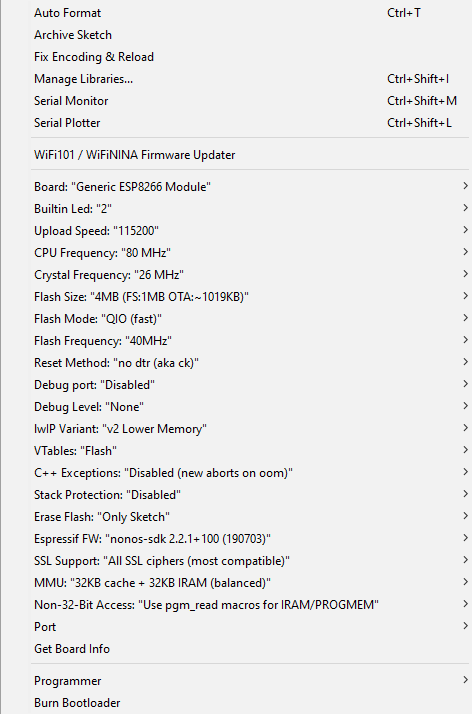

# IR Blaster Solution

## Setting up Arduino

1. Install Arduino IDE [here](https://www.arduino.cc/en/software). It is highly recommended you install via the link named "Windows Win 7 and newer" which is this [link](https://downloads.arduino.cc/arduino-1.8.19-windows.exe). Run this exectuable when it is installed and **DO NOT** install the version that is found on the app store (It's much easier to modify the IDE if you install it externally).

2. Open the Arduino IDE and navigate to File > Preferences from the toolbar. Under **Sketchbook location** navigate to the folder **SportsyearController** in this repo. Under **Additional Boards Manager URLs** paste: ```https://arduino.esp8266.com/stable/package_esp8266com_index.json```.

3. Navigate to Tools > Board > Board Manager and search for **esp8266** and install the result. Navigate to Tools > Board > ESP8266 and select the **Generic ESP8266 Module** option.

4. Navigate to Tools > Board and match the settings in the following image: <br></br> Under **Port** Select the port that the ESP8266 Module is connected to.

5. Navigate to Sketch > Include Libraries > Manage Libraries. Search for the following libraries and install them:
    - ArduinoJson by Benoit Blanchin
    - IRremoteESP8266 by David Conran
    - Time by Paul Stoffregen
    - WiFiManger by tablatronix
Finding the libraries may be difficult but this is a byproduct of how bad the Arduino IDE is (seriously it's a pain). Additionally, navigate [here](https://github.com/bebo-dot-dev/Cryptosuite) to install the **Cryptosuite** library, simply follow the instructions there.

6. Open the SportsyearController.ino file and click the tick button in the top left. This will verify the code (kind of like debugging it and pre-running to make sure there arent any errors) which will also help in making sure you have all the correct libraries.

7. After verification is complete, plug in the IR-Blaster and click the arrow next to the verify button. This will proceed to compile and upload the sketch to the blaster.

8. When the terminal says "soft resetting...", click the magnifying glass icon in the top right to open the serial monitor.

## Initial Setup of Blaster

1. Once the sketch is uploaded to the Arduino, the blaster will begin broadcasting a temporary network. Navigate to your devices WiFi settings and join the temporary network IR Controller Configuration. This should open a webpage automatically that will be used to configure the Wifi network the blaster is to operate on. If this webpage does not show up simply enter 192.168.4.1 into your devices web browser.

2. On the configuration webpage select **Configure WiFi**. Select the WiFi network you want to connect to and enter the password. Further down the page you can edit the hostname and port. The hostname should be set to something that identifies the blaster (e.g. HallwayTV) while the port can be anything (80 is the standard for HTTP services). It is also required that the  **Static IP** be changed to something other than the default to allow the program to automatically set the IP (Enter 192.168.1.15 or something)

3. When configuration is complete, select save. The serial monitor should begin to spit out information about the setup process. When completed, you can see the static IP assigned to the blaster. If you enter this into a web browser you can access the blaster. Alternatively, entering <selected_hostname>.local should also bring you to the webpage of the blaster.

## Blaster Routes

The blaster has the following routes:
|Route|HTTP Method|Parameters|Description|Return|
| ----------- | ----------- | ----------- | ----------- | ----------- |
|/ir/set_channel|POST|channel, type,  length|Sets TV channel to specified number|N/A|
|/ir/lower_volume|POST|type, length|Lower volume by 1|N/A|
|/ir/raise_volume |POST|type, length|Raise volume by 1|N/A|
|/ir/mute|POST|type, length|Mute Volume|N/A|
|/ir/power|POST|type, length|Power TV on/off|N/A|
|/ir/raise_channel/|POST|type, length|Raise channel by 1|N/A|
|/ir/lower_channel/|POST|type, length|Lower channel by 1|N/A|
|/ir/scan/|GET|N/A|Scans for blasters on the network|{ Device_name : { ip : <>, port: <> } }|

## Resources For Developing IR Blaster Webserver

1. Based on [this](https://github.com/mdhiggins/ESP8266-HTTP-IR-Blaster) webserver code.
2. This [repo](https://gist.github.com/francis2110/8f69843dd57ae07dce80) for IR codes for an LG/NEC TV.
